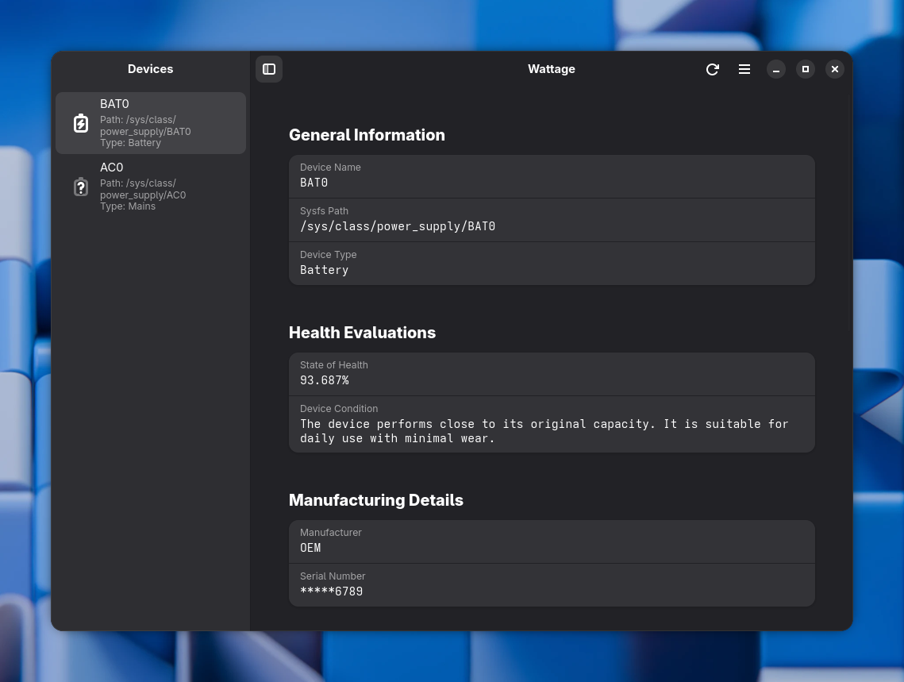
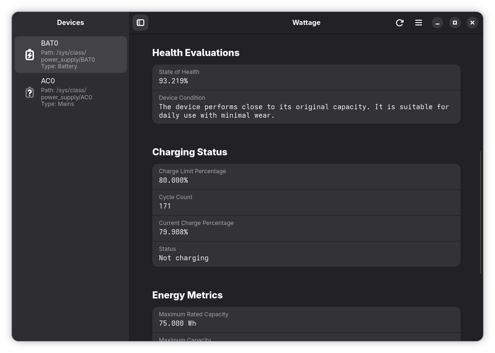
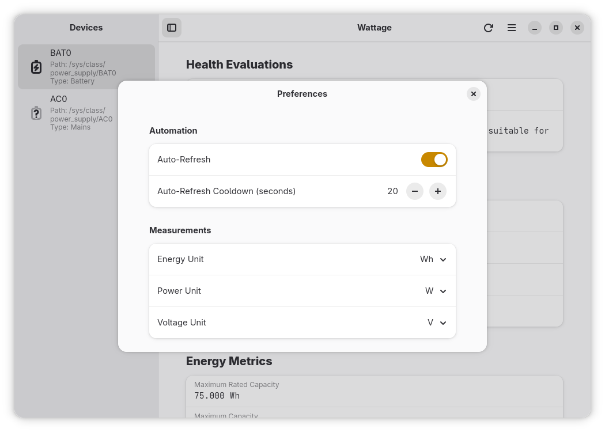

 

# Wattage


Wattage is an application designed for monitoring the health and status of your power devices. It displays quick data regarding battery capacity, energy metrics, and device information through a clean, modern GTK 4 + libadwaita interface.





## Notices

- Wattage does not support Windows, macOS, or any system that does not support retrieving battery information from the sysfs path `/sys/class/power_supply`

## Features

- Monitor a variety of statistics regarding your battery.
- View battery health, voltage data, model information, manufacturing details, and device status.
- Support for multiple batteries or power sources.
- Interface built with GTK 4 and libadwaita.
- Written in Vala, which is fast since it compiles to C.
- Designed for GNU/Linux systems with sysfs battery information.

## Installation

The following guide provides instructions on how to install Wattage.

### Manual Installation

#### Build Requirements

- Vala
- Meson
- Ninja
- libadwaita (version >= 1.8) and GTK 4
- pkgconf

Other requirements should be installed automatically as dependencies of the packages above.

#### Build Instructions

The steps for manually building Wattage is quite straightforward. Before starting, please make sure you installed all necessary requirements listed above.

1. Clone the repository:

```bash
git clone https://github.com/v81d/wattage.git
cd wattage
```

2. Configure the build directory as `_build/`:

```bash
meson setup _build -Dbuildtype=debug
```

3. Compile the project and the settings schema in `_build/data/`:

```bash
ninja -C _build
glib-compile-schemas --targetdir=_build/data data
```

4. Verify that the app runs:

```bash
GSETTINGS_SCHEMA_DIR=_build/data ./_build/src/wattage
```

#### Installation with Ninja

To install the app using Ninja, run the following command in the project root:

```bash
sudo ninja -C _build install
```

Henceforth, you can simply run the app from your launcher or by running the command:

```bash
wattage
```

If you ever want to uninstall the app, `cd` to the project root and run:

```bash
sudo ninja -C _build uninstall
```

#### Export as AppImage

If you want to export the app as an AppImage, begin by installing [appimage-builder](https://github.com/AppImageCrafters/appimage-builder). Then, build the file:

```bash
meson install -C _build --no-rebuild --destdir "AppDir"
appimage-builder --appdir _build/AppDir --recipe AppImageBuilder.yml
```

A `Wattage-latest-x86_64.AppImage` file should then appear in the project root. To launch the AppImage, run:

```bash
./Wattage-latest-x86_64.AppImage
```

#### Export as Flatpak

Make sure both [Flatpak](https://flatpak.org) and [Flatpak Builder](https://github.com/flatpak/flatpak-builder) are installed. Then, add the Flathub repository if it's not already present:

```bash
flatpak remote-add --if-not-exists flathub https://flathub.org/repo/flathub.flatpakrepo
```

Next, install the necessary runtimes and SDKs:

```bash
flatpak install -y \
    org.gnome.Platform//49 \
    org.gnome.Sdk//49 \
    org.freedesktop.Sdk.Extension.vala//25.08
```

Finally, build the Flatpak and create the bundle:

```bash
flatpak-builder \
    --repo=repo \
    --ccache \
    --force-clean \
    build io.github.v81d.Wattage.json
flatpak build-bundle repo io.github.v81d.Wattage.flatpak io.github.v81d.Wattage
```

Now, you can install the bundle with the following commands:

```bash
flatpak install --user -y io.github.v81d.Wattage.flatpak
```

To run the app, select it from your launcher or run:

```bash
flatpak run io.github.v81d.Wattage
```

## Contributing

### Reporting Issues

To report an issue or bug, visit Wattage's [issue tracker](https://github.com/v81d/wattage/issues) on GitHub.

### Translating the Project

You can contribute by adding translations for strings in the application. See [TRANSLATING.md](TRANSLATING.md) for more information.

### Pull Requests

To push your features or fixes into this official repository:

1. Fork the repository.
2. Create a feature branch (`git checkout -b feature/my-feature`) or a fix branch (`git checkout -b fix/my-fix`).
3. Commit your changes (`git commit -m "feat: add new feature"`).
4. Push the branch (`git push origin feature/my-feature`).
5. Open a pull request with `contrib` as the base branch.

## License

Wattage is free software distributed under the **GNU General Public License, version 3.0 or later (GPL-3.0+).**

You are free to use, modify, and share the software under the terms of the GPL.
For full details, see the [GNU General Public License v3.0](https://www.gnu.org/licenses/gpl-3.0.html).
