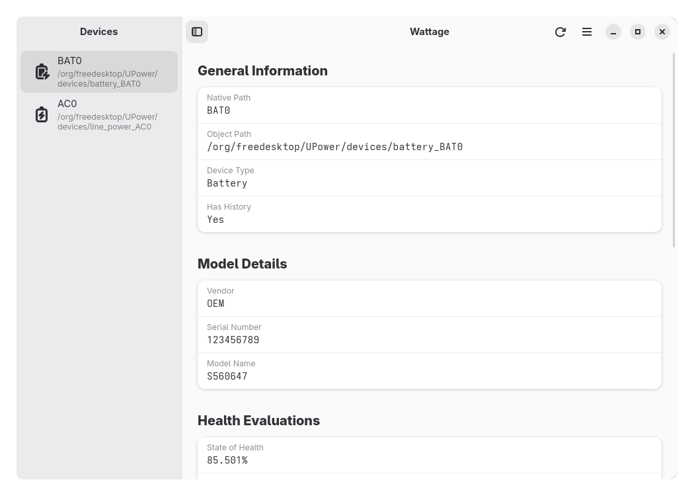
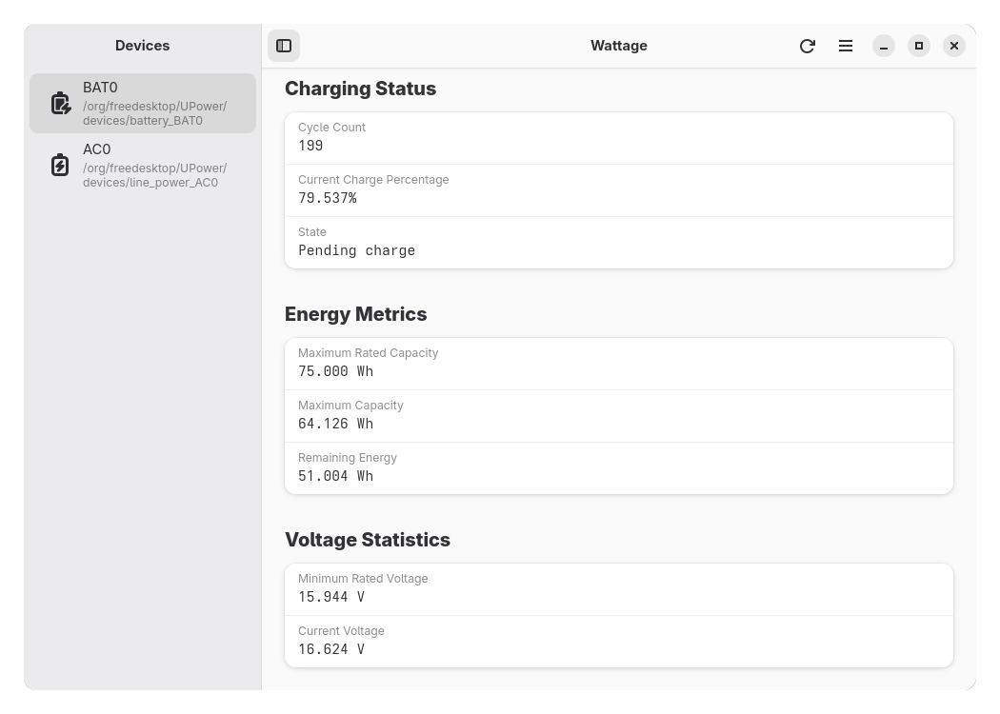
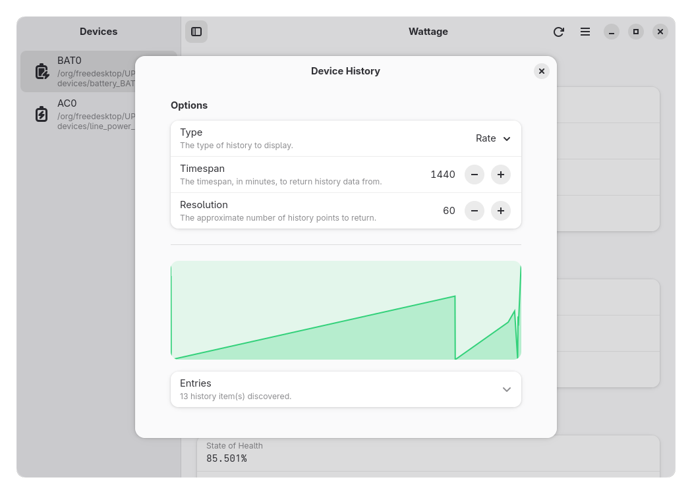
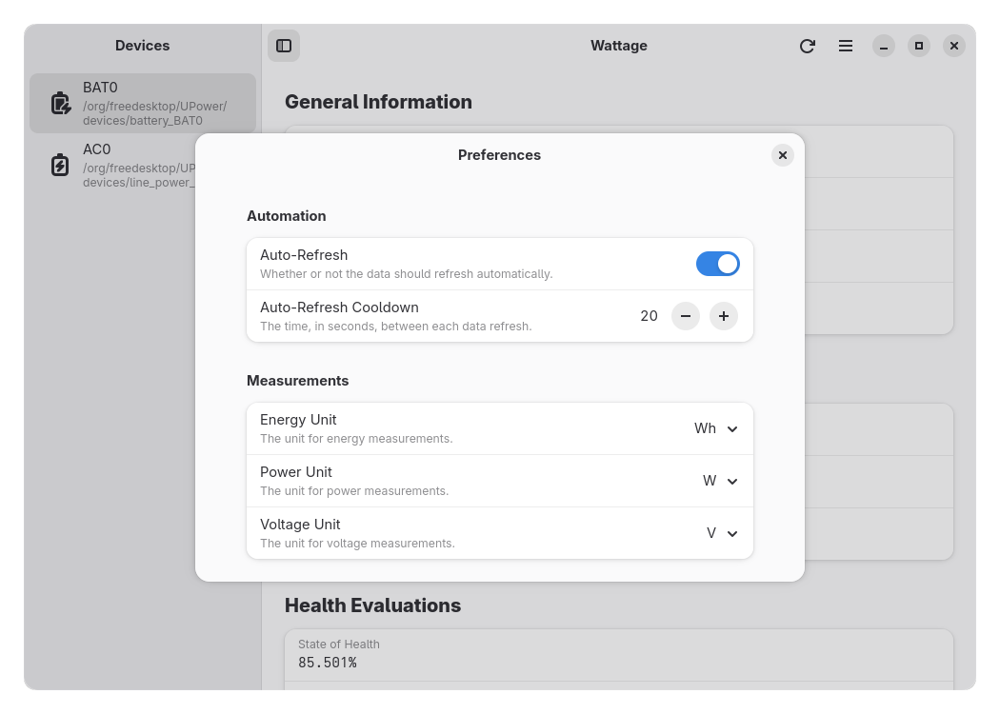

# Wattage


Wattage is an application designed for monitoring the health and status of your power devices. It displays quick data regarding battery capacity, energy metrics, and device information through a clean, modern GTK 4 and libadwaita interface.






## Notices

Wattage does not support Windows, macOS, or any system that does not support retrieving power information from [UPower](https://upower.freedesktop.org). However, nearly all Linux distributions with a user interface or desktop environment (such as GNOME, KDE Plasma, etc.) have UPower installed, so Wattage should work on almost all desktops. Some BSD operating systems also support UPower, but full functionality is not guaranteed.

## Features

- Monitor a variety of statistics regarding your battery.
- View battery health, voltage data, model information, manufacturing details, and device status.
- Support for multiple batteries or power sources.
- Interface built with GTK 4 and libadwaita.
- Written in Vala, which is fast since it compiles to C.
- Designed for systems with UPower power information.

## Installation

The following guide provides instructions on how to install Wattage on your device.

<a href="https://repology.org/project/wattage/versions">
    
</a>

<div style="display: flex; flex-wrap: wrap; align-items: center; gap: 20px;">
    <a href="https://nightly.link/v81d/wattage/workflows/build-appimage/main">
        
    </a>
    <a href="https://flathub.org/apps/io.github.v81d.Wattage">
        
    </a>
</div>

### Manual Installation

#### Build Requirements

- The [Vala language](https://vala.dev)
- [Blueprint Compiler](https://gnome.pages.gitlab.gnome.org/blueprint-compiler)
- The [Meson build system](https://mesonbuild.com)
- [Ninja](https://ninja-build.org)
- [GNU gettext](https://www.gnu.org/software/gettext)
- [pkg-config](https://www.freedesktop.org/wiki/Software/pkg-config)
- [glib](https://docs.gtk.org/glib)
- [libadwaita](https://gnome.pages.gitlab.gnome.org/libadwaita) (version >= 1.8)
- [GTK 4](https://www.gtk.org) (version >= 4.18.0)
- [libgee](https://gitlab.gnome.org/GNOME/libgee)
- [GObject Introspection](https://gi.readthedocs.io/en/latest)
- [AppStream](https://www.freedesktop.org/wiki/Distributions/AppStream)

Other requirements should be installed automatically as dependencies of the packages above.

#### Build Instructions

The steps for manually building Wattage is quite straightforward. Before starting, please make sure you installed all necessary requirements listed above.

1. Clone the repository:

```bash
git clone https://github.com/v81d/wattage.git
cd wattage
```

2. Configure the build directory using Meson:

```bash
meson setup build
```

3. Compile and build the project:

```bash
meson compile -C build
```

4. Install project libraries and schemas:

```bash
meson install -C build --destdir staging
glib-compile-schemas build/staging/usr/local/share/glib-2.0/schemas
```

5. Run the project

```bash
GSETTINGS_SCHEMA_DIR=build/staging/usr/local/share/glib-2.0/schemas ./build/staging/usr/local/bin/wattage
```

## Contributing

### Reporting Issues

To report an issue or bug, visit Wattage's [issue tracker](https://github.com/v81d/wattage/issues) on GitHub.

### Translating the Project

You can contribute by adding translations for strings in the application. See [TRANSLATING.md](TRANSLATING.md) for more information.

### Pull Requests

To push your features or fixes into this official repository:

1. Fork the repository.
2. Create a feature branch (`git checkout -b feature/my-feature`) or a fix branch (`git checkout -b fix/my-fix`).
3. Commit your changes (`git commit -m "feat: add new feature"`). **Please follow the [Conventional Commits](https://www.conventionalcommits.org) guideline when doing so!**
4. Push the branch (`git push origin feature/my-feature`).
5. Open a pull request with `contrib` as the base branch. Make sure to create a detailed title and description of your change.

Please follow the [GitHub flow](https://guides.github.com/introduction/flow) and the [GNOME Code of Conduct](CODE_OF_CONDUCT.md) when submitting a pull request.

## License

Wattage is free software distributed under the **GNU General Public License, version 3.0 or later (GPL-3.0+).**

You are free to use, modify, and share the software under the terms of the GPL.
For full details, see the [GNU General Public License v3.0](https://www.gnu.org/licenses/gpl-3.0.html).
