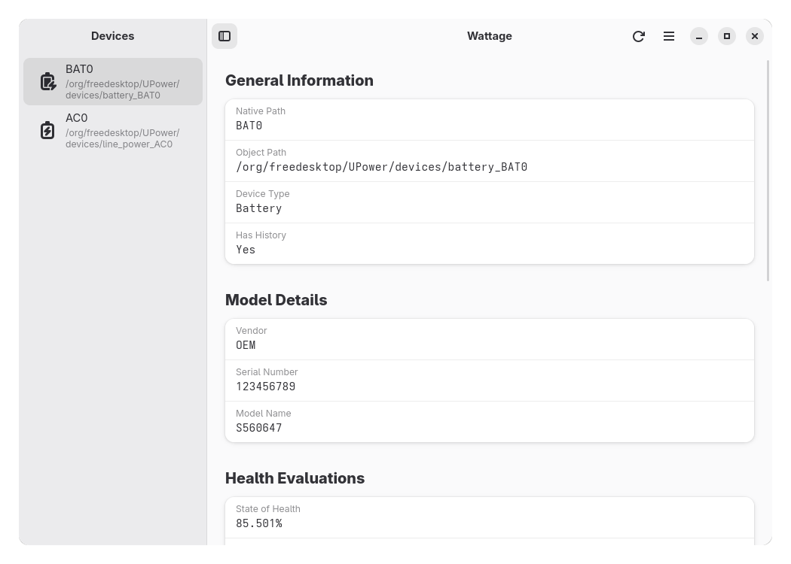
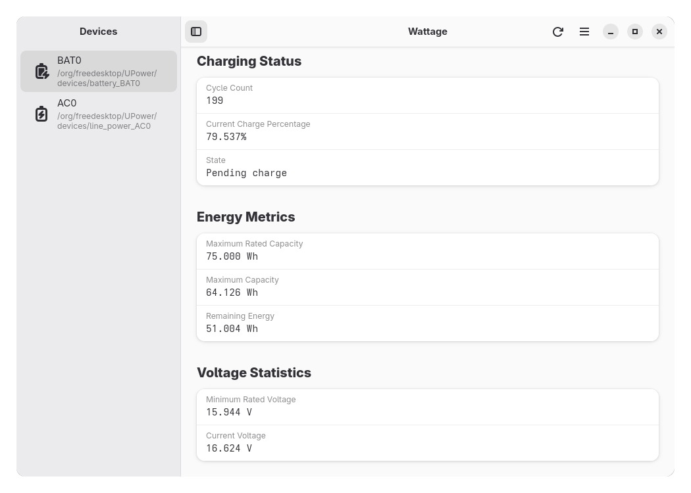
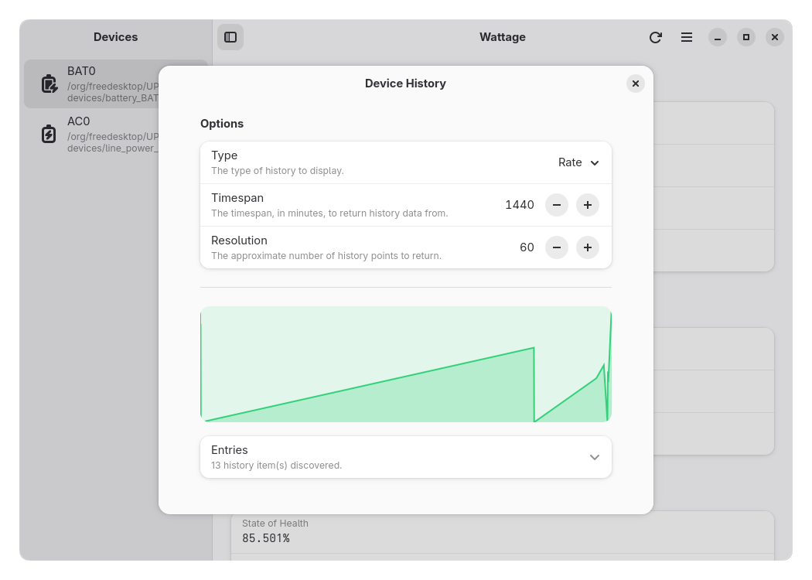
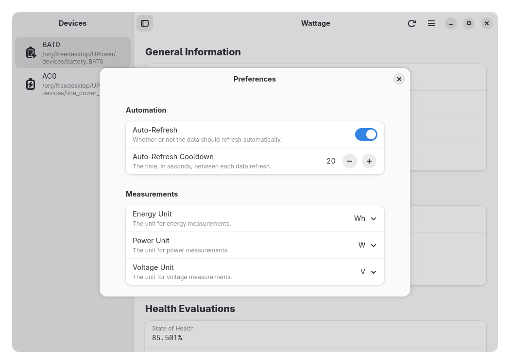

# Wattage


Monitor the health and status of power devices without the hassle.

<table>
    <tr>
        <td align="center">
            
        </td>
        <td align="center">
            
        </td>
    </tr>
    <tr>
        <td align="center">
            <b>General power device information</b>
        </td>
        <td align="center">
            <b>Health and energy statistics</b>
        </td>
    </tr>
    <tr>
        <td align="center">
            
        </td>
        <td align="center">
            
        </td>
    </tr>
    <tr>
        <td align="center">
            <b>Device history information</b>
        </td>
        <td align="center">
            <b>Options and preferences</b>
        </td>
    </tr>
</table>

## Features

- See power information about your battery, AC power cable, headset, stylus, and more.
- View battery health, voltage, model, manufacturing details, and status.
- See battery history displayed in a list and graph. _(*To be revamped.)_
- Support for multiple power sources.

## Supported Systems

Wattage works on systems with DBus and UPower installed, which includes nearly all Linux distributions. Since Windows and macOS do not work with DBus nor UPower, they are unsupported.

BSD systems (FreeBSD, OpenBSD, NetBSD, etc.) that package DBus and UPower may be supported, though they have not been tested. _(Testers are welcome!)_

## Installation

The following guide provides instructions on how to install Wattage on your device.

<a href="https://repology.org/project/wattage/versions">
    
</a>

<div style="display: flex; flex-wrap: wrap; align-items: center; gap: 20px;">
    <a href="https://nightly.link/v81d/wattage/workflows/build-appimage/main">
        
    </a>
    <a href="https://flathub.org/apps/io.github.v81d.Wattage">
        
    </a>
</div>

### Nix Flake

You can install Wattage using the official Nix flake. You can either do this declaratively (recommended for NixOS / Home Manager users) or imperatively.

#### Declarative/Flake Installation (Recommended for NixOS / Home Manager Users)

To install Wattage declaratively using Nix flakes, follow the steps:

1. Add the repository to your Nix configuration flake inputs:

```nix
inputs = {
  # ...
  wattage.url = "github:v81d/wattage";
  # ...
};
```

2. Add Wattage to package list:

```nix
# System-wide packages (configuration.nix)
environment.systemPackages = [
  # ...
  inputs.wattage.packages.${pkgs.stdenv.hostPlatform.system}.default
  # ...
];

# Home Manager
home.packages = [
  # ...
  inputs.wattage.packages.${pkgs.stdenv.hostPlatform.system}.default
  # ...
]
```

#### Imperative Installation

To install Wattage imperatively, simply run the command:

```bash
nix profile add "github:v81d/wattage"
```

This will install all dependencies for the package and Wattage itself. After installation, you should be good to go.

#### Run Once

To run Wattage only once without installing it, run:

```bash
nix run "github:v81d/wattage"
```

### Manual Installation

#### Build Requirements

- The [Vala language](https://vala.dev)
- [Blueprint Compiler](https://gnome.pages.gitlab.gnome.org/blueprint-compiler)
- The [Meson build system](https://mesonbuild.com)
- [Ninja](https://ninja-build.org)
- [GNU gettext](https://www.gnu.org/software/gettext)
- [pkg-config](https://www.freedesktop.org/wiki/Software/pkg-config)
- [glib](https://docs.gtk.org/glib)
- [libadwaita](https://gnome.pages.gitlab.gnome.org/libadwaita) (version >= 1.8)
- [GTK 4](https://www.gtk.org) (version >= 4.18.0)
- [libgee](https://gitlab.gnome.org/GNOME/libgee)
- [GObject Introspection](https://gi.readthedocs.io/en/latest)
- [AppStream](https://www.freedesktop.org/wiki/Distributions/AppStream)

Other requirements should be installed automatically as dependencies of the packages above.

#### Build Instructions

The steps for manually building Wattage is quite straightforward. Before starting, please make sure you installed all necessary requirements listed above.

1. Clone the repository:

```bash
git clone https://github.com/v81d/wattage.git
cd wattage
```

2. Configure the build directory using Meson:

```bash
meson setup build
```

3. Compile and build the project:

```bash
meson compile -C build
```

4. Install project libraries and schemas:

```bash
meson install -C build --destdir staging
glib-compile-schemas build/staging/usr/local/share/glib-2.0/schemas
```

5. Run the program:

```bash
GSETTINGS_SCHEMA_DIR=build/staging/usr/local/share/glib-2.0/schemas ./build/staging/usr/local/bin/wattage
```

## Contributing

Please see the official [Contributing Guide](CONTRIBUTING.md) for information about contributing to Wattage.

## License

Wattage is free software distributed under the **GNU General Public License, version 3.0 or later (GPL-3.0+).**

You are free to use, modify, and share the software under the terms of the GPL.
For full details, see the [GNU General Public License v3.0](https://www.gnu.org/licenses/gpl-3.0.html).
